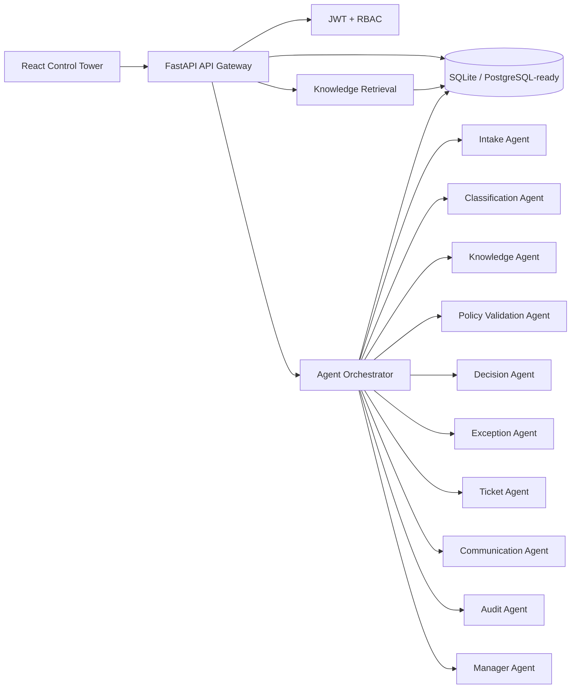
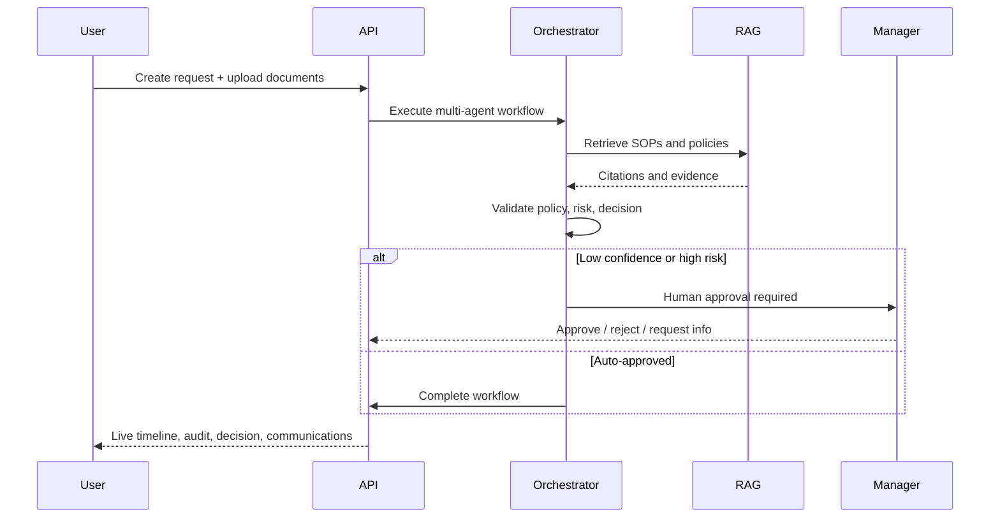

# OpsFlow AI

**Autonomous Enterprise Operations Orchestrator**

OpsFlow AI is a production-style hackathon application that demonstrates an agentic AI operations control center for shared-services and banking workflows. It includes a FastAPI backend, React 19/Vite frontend, JWT authentication, a lightweight RAG knowledge center, multi-agent workflow orchestration, human approvals, audit trails, analytics, and seeded operational data.

## Architecture



## Workflow Sequence



## Seeded Users

| Role | Email | Password |
| --- | --- | --- |
| Administrator | admin@opsflow.ai | password123 |
| Operations Manager | manager@opsflow.ai | password123 |
| Operations Executive | ops@opsflow.ai | password123 |
| Viewer | viewer@opsflow.ai | password123 |

## Role-Based Access

- Administrator: full platform access, including User Management.
- Operations Manager: all operations requests, approvals, audit logs, analytics, agent monitoring, and knowledge governance.
- Operations Executive: create and operate assigned requests, upload supporting documents, and contribute knowledge.
- Viewer: read-only operational visibility.

## Demo Mode

Administrators and Operations Managers can use **Reset Demo Data** on the dashboard to regenerate realistic operations workflows, agent conversations, audit history, approvals, SOP citations, analytics, and risk scores without calling OpenAI.

## Quick Start

### Backend

```bash
cd backend
python -m venv .venv
.venv\Scripts\activate  # Windows
pip install -r requirements.txt
python seed.py
uvicorn app.main:app --reload --port 8000
```

### Frontend

```bash
cd frontend
npm install
npm run dev
```

Open [http://localhost:5173](http://localhost:5173). The frontend defaults to `http://localhost:8000` for API calls.

## Environment

Copy `.env.example` to `.env` in the project root or backend runtime environment. `OPENAI_API_KEY` is required for AI orchestration, semantic retrieval, image document parsing, structured risk scoring, and streaming workflow execution. Without it, non-AI CRUD APIs still run, while AI endpoints return a clear `503` configuration error.

For production, set `ENVIRONMENT=production`, replace `JWT_SECRET`, configure `CORS_ORIGINS` to the deployed frontend origin, and use a persistent `DATABASE_URL` such as managed PostgreSQL. The seeded demo accounts are intended for local/demo use only and should be rotated or removed before handling real data.

## Native Startup Scripts

From the project root:

```powershell
.\start.ps1
```

```cmd
start.bat
```

```bash
./start.sh
```

## Deployment

Frontend can be deployed to Vercel from `frontend/`. Set `VITE_API_BASE_URL` to the deployed Render backend URL.
Backend can be deployed to Render using the root `render.yaml` blueprint. The backend `render.yaml` mirror is kept for teams that import the backend service directly, but the root file is the canonical GitHub deployment configuration.

Configuration files are included:

- `frontend/vercel.json`
- `render.yaml`
- `backend/render.yaml`

## Core API

- `POST /api/auth/login`
- `GET /api/me`
- `GET /api/dashboard/metrics`
- `GET /api/requests`
- `POST /api/requests`
- `GET /api/requests/{request_id}`
- `POST /api/requests/{request_id}/execute`
- `GET /api/requests/{request_id}/playback`
- `POST /api/approvals/{approval_id}/decision`
- `GET /api/agents`
- `POST /api/knowledge/upload`
- `GET /api/knowledge/search`
- `GET /api/audit`
- `GET /api/analytics`
- `GET /health`

## Example Prompt

> Customer Rajesh Kumar submitted a nominee update for account AC-847392. Aadhaar and nominee declaration are attached, but PAN is missing. Please validate against banking operations SOPs and draft the customer communication.

## Tests

```bash
cd backend
pytest
```

```bash
cd frontend
npm run build
```
